<!-- START doctoc generated TOC please keep comment here to allow auto update -->
<!-- DON'T EDIT THIS SECTION, INSTEAD RE-RUN doctoc TO UPDATE -->
**Contents**

- [Thumble](#thumble)
  - [How it's designed musically; how to play it](#how-its-designed-musically-how-to-play-it)
    - [Musical notes](#musical-notes)
    - [Special keys](#special-keys)
    - [Joystick](#joystick)
  - [Shepard Tones](#shepard-tones)
  - [Hardware](#hardware)
    - [Alternative microcontrollers](#alternative-microcontrollers)
  - [Case](#case)
  - [Assembly sequence](#assembly-sequence)
  - [The firmware code](#the-firmware-code)
  - [Arduino setup and flashing the board](#arduino-setup-and-flashing-the-board)
  - [Aside: solving "The connected device requires too much power" on iOS devices](#aside-solving-the-connected-device-requires-too-much-power-on-ios-devices)
  - [Soldering](#soldering)
- [Build photos](#build-photos)
  - [Laser cutting](#laser-cutting)
  - [Case Assembly](#case-assembly)
  - [Electronics](#electronics)
- [Lessons learned](#lessons-learned)
- [Appendix: MIDI synth apps to turn MIDI into sound](#appendix-midi-synth-apps-to-turn-midi-into-sound)

<!-- END doctoc generated TOC please keep comment here to allow auto update -->

# Thumble

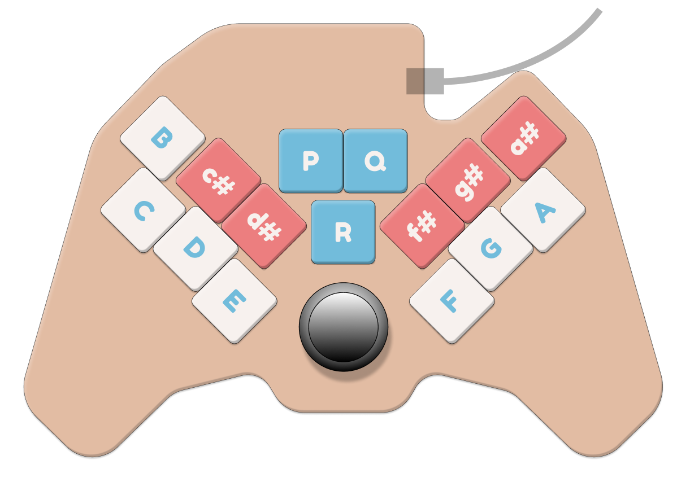

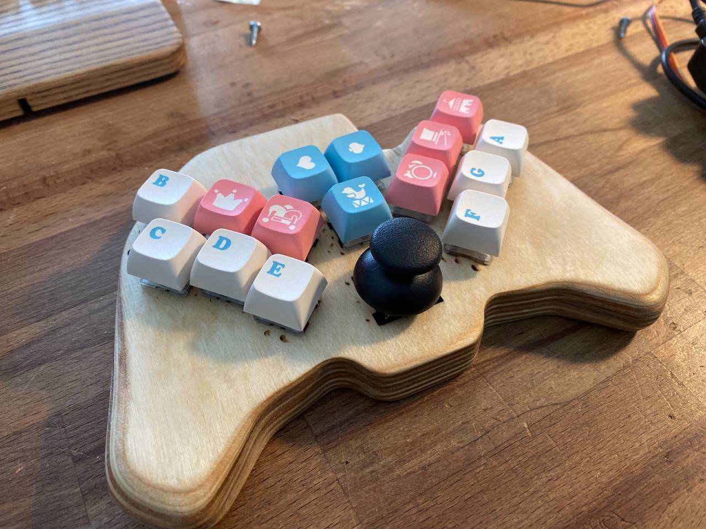

A MIDI controller in the shape of a video game controller (e.g. xbox), but using mechanical-keyboard buttons.

Like some MIDI keyboards, it doesn't make actual sound, it only sends digital notes over USB to a computer or synthesizer.

## How it's designed musically; how to play it

Hold it like an Xbox controller.  Play it like a kalimba, with your thumbs.

The diagonal keys are notes; the 3 keys in the middle are extra function keys.  The joystick is for pitch bends.

### Musical notes

Unlike a kalimba, the notes are arranged piano style.  There's one octave starting at B on the left and ascending to Bb on the right.  Like a piano, white keys are on the bottom row and black keys are on the top row (except for B).

Because we use Shepard Tones (more below), you can play a melody so that it wraps off one side of the keyboard and back onto the other side, without noticing a jump in octaves.

### Special keys

The middle keys S, T, and U are for special purposes.  Currently:

* S is volume down (like a multimedia keyboard -- controlling the computer volume)
* T is volume up
* U is a SHIFT key
    * SHIFT - B toggles between MIDI channel 0 and 1
    * SHIFT + a white key tranposes the keyboard to different octaves.  F gets you the default octave.

...but check the [source code](https://github.com/cinnamon-bun/thumble/blob/main/thumble_001_arduino/thumble_001_arduino.ino#L97-L102) for the latest changes to the special keys.

The middle keys could possibly do other things like:
* play specific MIDI pitches where drum sounds can be set up, that would ignore the transpose settings and pitch bends.

### Joystick

The joystick is not programmed yet (TODO), but it will do pitch bends.  Left/right will bend by a half step, and up/down will bend by a whole step.

It could also act as a mod wheel on one axis and a pitch bend on the other axis.

## Shepard Tones

There's only room for 12 notes, but wouldn't it be nice if you could wrap around the edge when playing a melody without jumping an octave?

We use an auditory illusion called [Shepard Tones](https://en.wikipedia.org/wiki/Shepard_tone) to make this possible.  Each key actually plays several octaves of that note at the same time, but with louder notes in the middle octaves, to maintain the loudest note in the same octave despite the illusion of constantly ascending tones.

As you go up, the higher octaves fade away and the lower octaves fade in to take their place, until you wrap around seamlessly.

For example:
* C plays C1 at 50% and C2 at 50% volume.
* D plays D1 at 58% and D2 at 42%.
* ...etc, with the upper octave fading away until we get to the middle of the scale and the upper octave is gone.  Then we start bringing in the octave below...
* F plays F1 at 92% and F2 at 8%.
* F# plays F#1 at 100%
* G plays G0 at 8% and G1 at 92%
* and eventually we end up back where we started:
* B plays B0 at 42% and B1 at 58%

## Hardware

1. Arduino / microcontroller: [Feather 32u4 basic proto](https://www.adafruit.com/product/2771) is the simplest Feather board from Adafruit.  If these are out of stock, look for the exact same thing on Amazon (sold by Adafruit).
1. Cherry MX compatible keyswitches (x 15)
    * I used [Gateron Silent Clear](https://novelkeys.xyz/products/gateron-silent-switches?_pos=2&_sid=fd79d8abc&_ss=r) since they have the weakest springs available and no tactile bump
1. Keycaps (x 15)
    * I used these [XDA profile](https://www.amazon.com/gp/product/B092H93KP6/ref=ppx_yo_dt_b_asin_title_o00_s00?ie=UTF8&psc=1) keycaps because they're pretty flat on top so it's easy to slide your thumbs around
1. This [joystick](https://www.adafruit.com/product/245) from Adafruit
1. [Magnetic USB cables](https://www.amazon.com/gp/product/B07GWLF4GR/ref=ppx_yo_dt_b_asin_title_o01_s00?ie=UTF8&psc=1) to avoid strain on the USB port.
1. Some wires
1. Soldering equipment
1. An app or hardware that accepts MIDI over USB and produces sound (see the Appendix at the end of this file.)

### Alternative microcontrollers

My advice is to stick with an Adafruit Feather board since they're mostly the same size and pinout, and all work with the Arduino IDE.

Make sure any microcontroller you use has 15 digital inputs and 2 analog inputs.  You'll have to adjust the plywood case to fit, as well.

* Some microcontrollers support Bluetooth Low Energy (BTLE), which you can use to pair with iOS devices for wireless MIDI playback.  Here's [Adafruit's guide](https://learn.adafruit.com/adafruit-feather/bluetooth-feathers).  I tried this and found it worked within about 15 feet, after that latency and jitter became a problem.  I also preferred to plug things together instead of messing with bluetooth menus.  Note also that a wireless Thumble will need a battery, and the Feather boards have integrated lithium battery pack connectors and circuitry.

* The [Elite-C](https://keeb.io/products/elite-c-low-profile-version-usb-c-pro-micro-replacement-atmega32u4) uses the same chip as the Feather, but the physical hardware is better.   It's smaller, and it has a strong USB-C port, while the Feather's USB-Micro port tends to rip off if the cord is pulled.

However the Elite-C can't be flashed from the Arduino IDE (because it uses the DFU bootloader instead of the Caterina bootloader that's normal for Arduino boards.)  You have to use the command line to flash it, and I'm not sure how to compile the code for it or make sure it supports MIDI-over-USB.

If you know how to solve that problem, you can use the Elite-C instead.  Note though that the case is designed for the Feather, which is larger.

* There's a new microcontroller made by Raspberry Pi called the [Raspberry Pi Pico](https://www.adafruit.com/product/4864), using their new RP2040 chip.  It's cheap and there are many variants already such as the [Adafruit feather RP2040](https://www.adafruit.com/product/4884) which has a USB-C port.  This microcontroller works with Circuit Python instead of Arduino, but Arduino code support is in the works.  It's much faster than needed for this project.

* Many mechanical keyboards use some kind of [Teensy](https://www.pjrc.com/teensy/) board, but there are many with different microcontrollers.  I'm guessing you'd want a Teensy 2 since it matches the Atmega 32u4 microcontroller we're using here?  Getting USB MIDI working is [a bit different](https://www.pjrc.com/teensy/td_midi.html) and it may require [special setup to work in the Arduino IDE](https://www.pjrc.com/teensy/teensyduino.html)

## Case

The case is laser cut from 7 layers of 1/8 inch material (3mm).  I used plywood and glued the layers, or you could use acrylic and figure out some screw holes.  The SVG files are in the `case` folder.

3mm plywood is too thick for the keyswitches to grab onto with their little latches.  You'll have to glue them into place (TODO: with what glue?).

The joystick and microcontroller are also a bit loose in the case; you'll have to improvise a way to keep them stable.  Maybe a spare piece of wood to pack the space below them.

The top layer SVG is flipped so that the laser smoke marks end up inside the case instead of outside.  Case level 4 is hollow, make three of those to stack up enough interior space for wiring.

## Assembly sequence

Refer also to the build photos below.

1. Software setup:
    1. Install the Arduino IDE and set it up as described below.
    1. Flash software to the microcontroller before you do anything else, just to make sure you can.  You won't be able to test it though.
1. Case:
    1. Laser-cut case layers from plywood.
    1. Align plywood layers, test-fitting keyswitches to ensure precise alignment.  (The keyswitches will not clip in securely; we glue them in a later step.)
    1. Glue all plywood layers except the back panel.
    1. Sand and finish the plywood.  Round off the edges of the handle to make it more comfortable to hold and to remove the burned part.
1. Assembly:
    1. Glue in the keyswitches, being carful not to get glue on the metal contacts.
    1. Put in the joystick and microcontroller and affix them somehow.
    1. Soldering time.
1. Testing:
    1. Test device functionality, press buttons, connect to MIDI software and see if it works.  Try using a "midi spy" program like Midi Monitor to observe the MIDI events it's sending.
1. Final packaging:
    1. Add more supports around the back of the joystick and microcontroller to hold them steady in their little caves when squeezed by the back panel.  Maybe glue some scrap wood?
    1. Also add some scrap wood to hold the USB port tight when the back cover is on.  The USB port tends to get ripped out when the cable is yanked.  Some superglue might help here if you're careful.
    1. Put the back panel on with wood screws, or use M2.5 machine screws in the provided holes.  You might need to open it again later.
    1. Put keycaps on the keyswitches.

## The firmware code

This code will turn the microcontroller into a USB MIDI input device, like a piano keyboard, that can be used with any other hardware (ipad, laptop, etc).

This is not based on any existing mechanical keyboard firmware because it's fairly simple.  There's just one GPIO pin to read each switch individually, and two analog inputs used for the joystick.

## Arduino setup and flashing the board

1. Install the official [Arduino IDE](https://www.arduino.cc/en/software).  The "hourly build" is free, the others cost money.
2. In the Arduino IDE, install the Adafruit board profiles using [instructions from Adafruit](https://learn.adafruit.com/adafruit-feather-32u4-basic-proto/arduino-ide-setup).  Specifically, the Adafruit board manager URL to add is `https://adafruit.github.io/arduino-board-index/package_adafruit_index.json`
3. Set board: Adafruit Feather 32u4 basic proto
4. Add libraries: MIDIUSB

Open the arduino code in `thumble_001_arduino`.  Hit the checkmark button to see if it compiles with no problems.

To send the code to the board, press the button in the IDE's top left corner with the right arrow.  You do not need to press the reset button on the board when flashing it.

## Aside: solving "The connected device requires too much power" on iOS devices

iOS devices will complain that the Thumble is requesting 500mA of power, which is too much.  It doesn't really need that much power, it's just part of the power negotiation process of plugging USB devices together where they claim how much they need.

Unfortunately, fixing this requires hacking a file in the Arduino IDE.  This file is likely to be un-hacked every time the Arduino IDE is updated, so watch out.

These instructions are adapted from https://github.com/arduino-libraries/MIDIUSB/issues/22

1. Find the file `hardware/arduino/avr/cores/arduino/USBCore.h`.  On my mac is was under `/Applications/Arduino.app/Contents/Java/`.  So the total path is `/Applications/Arduino.app/Contents/Java/hardware/arduino/avr/cores/arduino/USBCore.h`
1. Change... `#define USB_CONFIG_POWER    (500)`
1. To...     `#define USB_CONFIG_POWER    (98)`

Re-flash the board.  Now it will work when plugged into a iOS device via something like the weirdly named [Lightning to USB Camera Adaptor](https://www.apple.com/shop/product/MD821AM/A/lightning-to-usb-camera-adapter), which is not just for cameras but for any USB device.

There's also a version of that adaptor that has an extra lightning power input for wall power -- using that and plugging in wall power at the same time will probably bypass the USB power warning but creates a mess of cables.

So my cable setup is: Thumble --> usb-C to usb A cable --> Apple camera adaptor to lightning plug --> iPod Touch

(I haven't tried this on any USB-C equipped iOS devices, only through the USB-A to lightning dongle.  Maybe things just work on USB-C iOS devices.)

If you don't have an iOS device and you need a portable hardware synth to turn your MIDI into sounds, the [iPod Touch](https://www.apple.com/ipod-touch/) is not a bad option.  It's $200, can run most iOS music apps and synths, battery powered, small, has (tiny) speakers and headphone output.  One could be mounted to a Thumble somehow.
This is what I use when I'm not at my computer.

See the Appendix below for app recommendations.

P.S. I'd love to hear any other options for portable battery-powered MIDI synths with audio out, I don't want to support Apple specifically.

## Soldering

We can wire each key directly between GND and an input pin, since we don't have many keys.  (Otherwise in a bigger keyboard we'd build a key matrix using diodes.)

For simplicity, a few GND wires can run along tracks in the case and connect to every key.  Then attach a signal wire from each key to a unique pin on the microcontroller.

We use 15 digital input pins for keys.

The joystick uses up two analog inputs and needs a ground and 3v wire too.

Wiring diagram ([click to enlarge](https://raw.githubusercontent.com/cinnamon-bun/thumble/main/final_v006-wiring.png)):

The thick black wiggly wire is a ground wire that connects to each keyswitch.  It fits into the wiggly channel in the plywood.  You can use one long wire for this, or several smaller wires, whatever is easier.

**ERRATA** The joystick board is horizontally flipped in this diagram, but it might not actually matter because the board might be symmetrical.  Double-check.

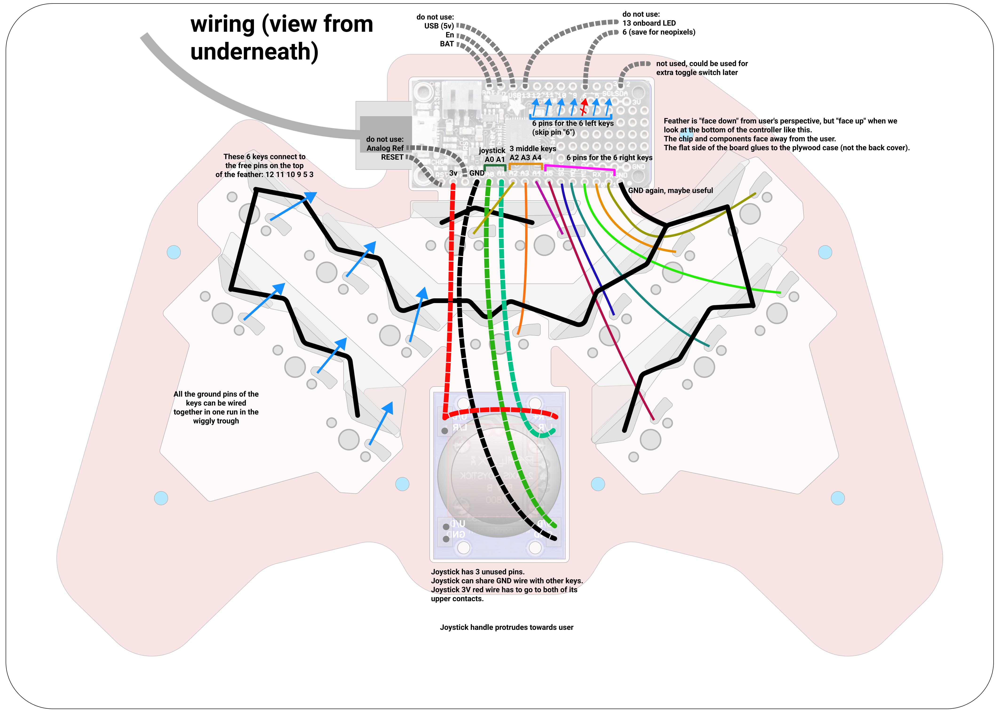

You can adjust the key-to-pin assignments in the code if you soldered things a bit differently.  Look for the `#define KEY00_PIN` lines around line 90.

# Build photos

## Laser cutting

Laser cutting the case layers from 1/8 inch plywood
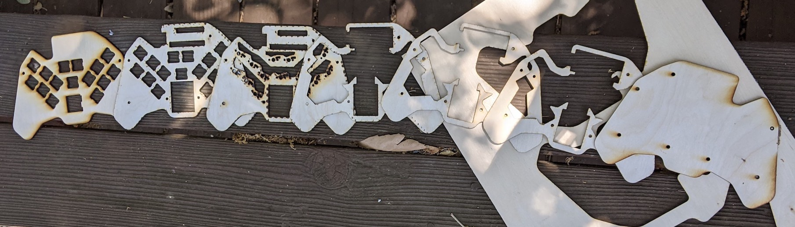

## Case Assembly

Gluing the case layers
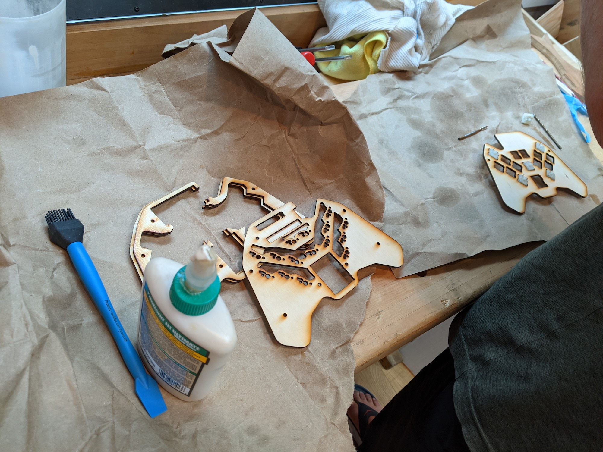

Test fitting the switches for layer alignment

Gluing
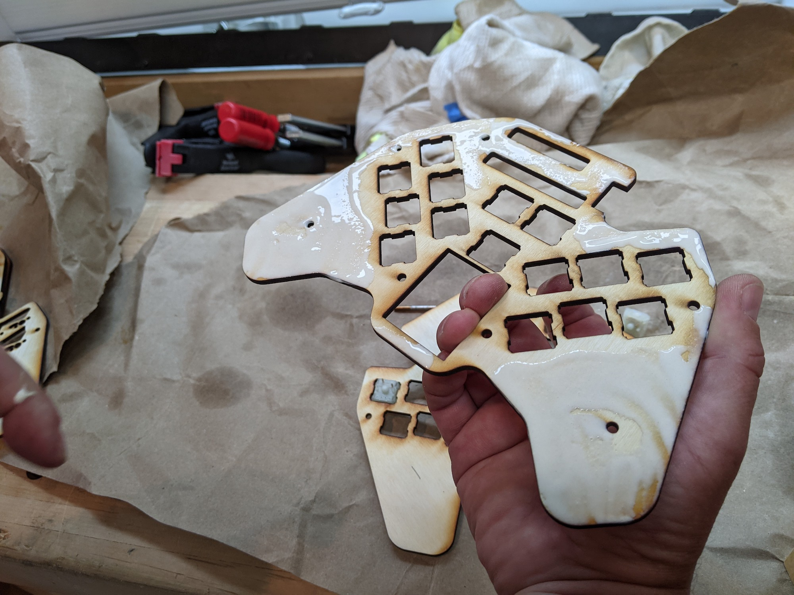

We used TiteBondIII Ultimate Wood Glue
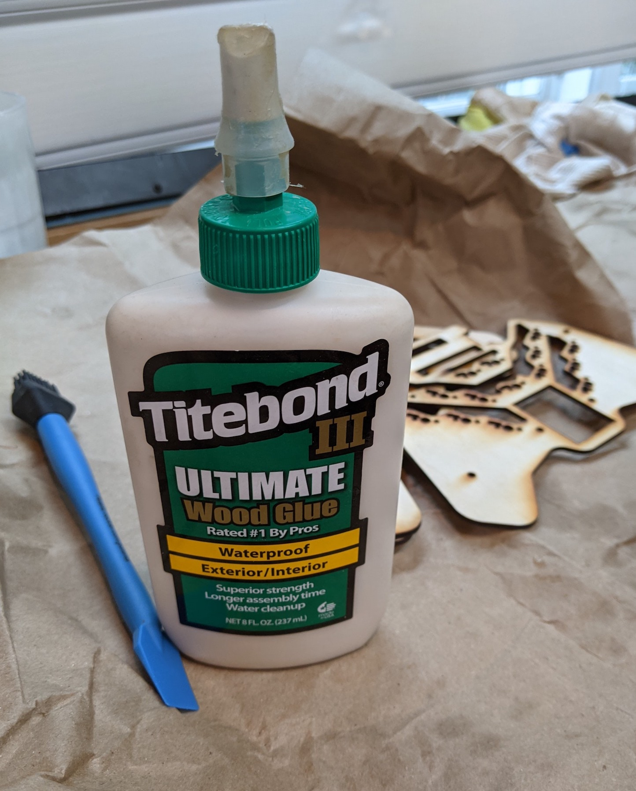

Clamping & gluing
.jpeg)
.jpeg)

The layer stack showing the USB area
.jpeg)

Counterset Torx screws to hold the back over
.jpeg)
.jpeg)

Sanding round edges
.jpeg)
.jpeg)
.jpeg)

## Electronics

Fitting the electronics.  We had to cut off a corner of the case to make room for the USB cord.
.jpeg)
.jpeg)

Improvised way to hold the Feather board steady
.jpeg)

Final case assembly
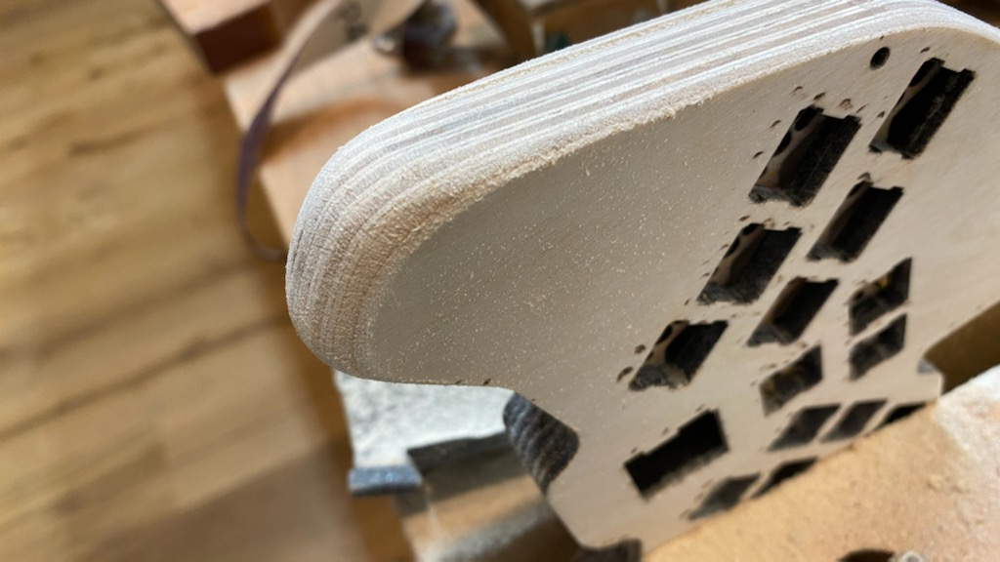
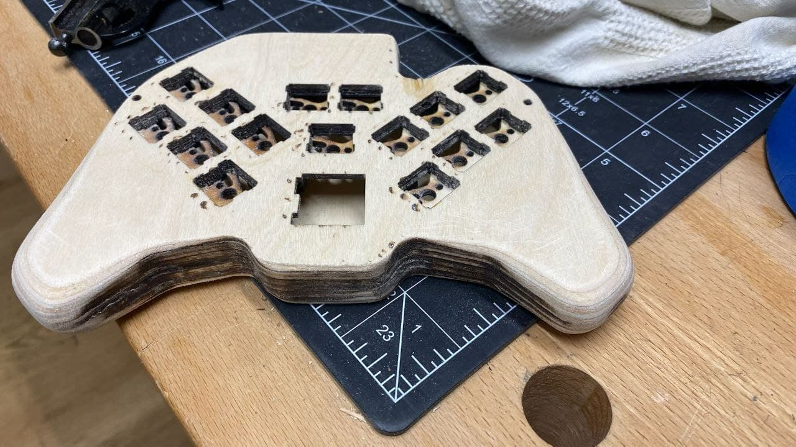

Soldering and gluing in the PCBs.
We used 2-part epoxy to hold the keyswitches to the wood.  The PCBs are held in with hot glue and blocks of wood that press them against the back cover for stability.
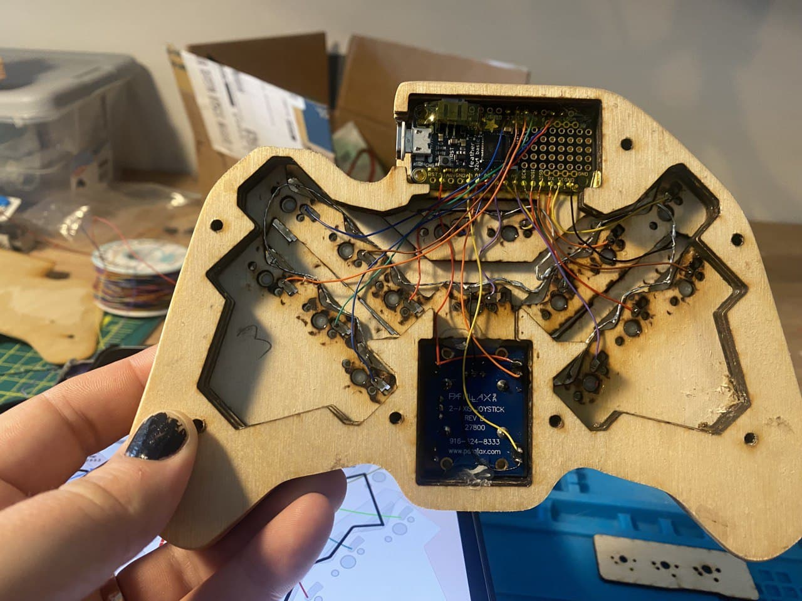

Keycap layout
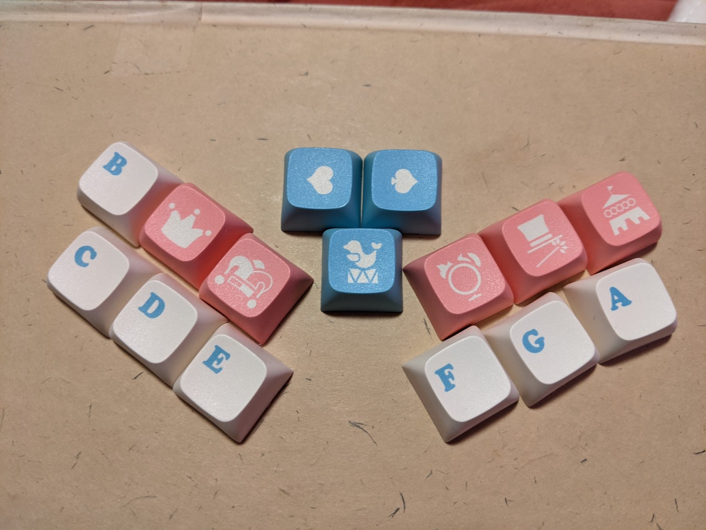

(Not pictured: flashing the firmware.)

Finished!

# Lessons learned

Layer cut plywood layers make a great case, although a bit heavy.

This instrument was designed as a follow-up to the [Waffletone](https://github.com/cinnamon-bun/waffletone), but it differes in several ways:
* You play with your thumbs, not fingers, and thumbs are stronger and more clumsy
* There's a lot more large thumb motion between keys, while the Waffletone tends to leave fingers on the same keys and make smaller motions.

So...
* The keyswitches need to be stiffer than I expected - you're using your thumbs, not fingers, and it's too easy to hit the wrong key accidentally.  Possibly even a tactile key, which I normally dislike.
* Since you don't play chords, you don't need to have a lot of key travel to help you synchronize your notes starting at the same instant.  Maybe low profile keys like Kailh Chocs would work better.
* Maybe the front keys could be lower profile than the back keys
* Put a bit more space between keyswitches to avoid accidental keypresses
* Add an extra top plate to make the keyswitches not so tall
* Add extra bottom plate pieces on the handles as grips for the fingers
* Remember to leave space for a USB cable :)

# Appendix: MIDI synth apps to turn MIDI into sound

Desktop
* Ableton Live
* Bitwig Studio
* Garage Band (mac only)
* Some other DAW (digital audio workstation)

Open source, multi platform
* [Ardour](https://ardour.org/)
* SunVox (ideosyncratic)

Android
* No good ones that I know of, the latency is too high

iOS
* Garage Band
* Thumbjam works great and has a library of sounds to download

Hardware (advanced)
* An iOS device with one of the above apps.  The iPod Touch is small and works well
* [Adafruit Music Maker FeatherWing](https://www.adafruit.com/product/3357) - a low quality midi synth on a little board
* [Axoloti](http://www.axoloti.com/) - higher quality, runs a PureData or Max/MSP style patch
* A Raspberry Pi with I don't know what software
